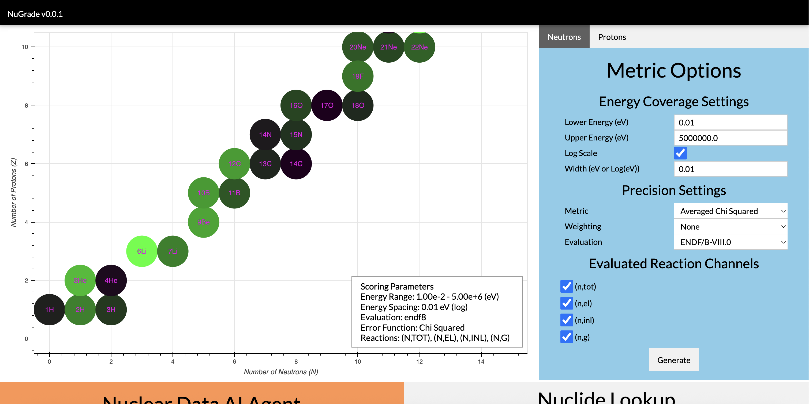
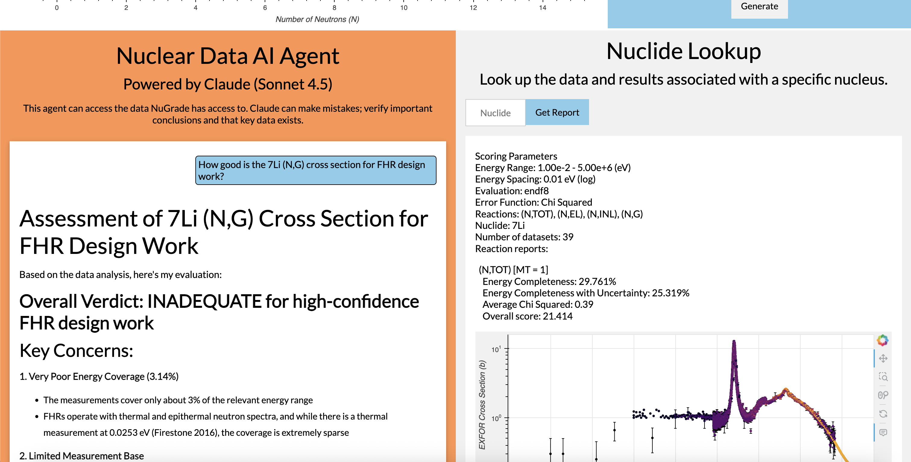

# NuGrade
NuGrade is a Flask-based tool for assessing the quality of nuclear data at a glance. It does this by comparing raw EXFOR data with evaluations. Error metrics such as absolute relative error or chi squared can be computed, capturing the deviation between evaluation and experiment. Energy coverage is also factored in, with reaction channels that are measured across a wide range of energy being scored better than those with only a few data points.


## Metric Options
|Parameter | Description |
|-----|--------|
|Lower Energy (eV)|The lower end of the energy range for which cross sections are scored|
|Upper Energy (eV)|The upper end of the energy range for which cross sections are scored|
|Log Scale|Whether energy coverage is considered on a linear or log scale|
|Width|How "wide" a measurement is considered in energy space when computing energy coverage|
|Metric|Which error metric to use for comparing EXFOR to evaluations. Absolute relative error is the simplest, while Chi squared factors in uncertainty.|
|Weighting|Flux function to weight the metric values by. High flux regions are the most important.|
|Evaluation|What evaluation to compare to.|

## Running a Local Copy
Due to the high volume of data needed to run this platform, this section is still under development while a more elegant solution for storage EXFOR and the various evaluations is considered.
### Pre-requisites 
The following packages are needed to run NuGrade locally:
- Numpy
- Pandas
- Matplotlib
- Bokeh
- Anthropic
- Markdown-it-py
### Installation
1. Clone the repo
```git clone https://github.com/iankolaja/NuGrade.git```
2. Install NuGrade
```python -m pip install .```
3. Add your Anthropic API key here (optional):
```keys/claude.txt```
4. Add your nuclear data library files:
```data/```
### Running
1. Run the top level script.
```python startnugrade.py```
2. Navigate to your web browser and open the locally hosted Flask application. Default local address: http://127.0.0.1:4000/
